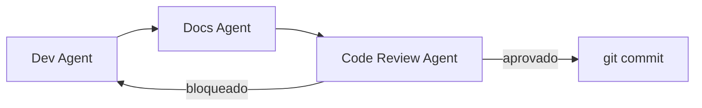

# Agentes HiveLogs

Agentes versionados para dividir responsabilidades: **desenvolvimento**, **documentação** e **code review**.

## Agentes

| Agente | Arquivo | Responsabilidade |
|--------|---------|------------------|
| **HiveLogs Dev** | [hivelogs-dev.mdc](./hivelogs-dev.mdc) | Implementar código da task (escopo IN), testes, boundaries |
| **HiveLogs Docs** | [hivelogs-docs.mdc](./hivelogs-docs.mdc) | Atualizar docs, shared-memory, ADR, README de módulo |
| **HiveLogs Code Review** | [hivelogs-code-review.mdc](./hivelogs-code-review.mdc) | Revisar diff **antes** de qualquer commit |

## Fluxo obrigatório por task

1. **Dev** — implementa escopo IN da task e roda verificação (`dotnet test`, etc.).
2. **Docs** — atualiza artefatos de documentação afetados (sempre `shared-memory.md` quando for task de techspec).
3. **Code Review** — revisa o diff completo; **gate obrigatório** antes do commit.
4. **Commit** — só após review **Aprovado** (skill `hivelogs-commit-workflow`).

## Como invocar no Cursor

- Mencione o agente: `@HiveLogs Dev`, `@HiveLogs Docs`, `@HiveLogs Code Review`
- Ou use as skills: `hivelogs-agent-dev`, `hivelogs-agent-docs`, `hivelogs-agent-code-review`
- Para uma task completa com gate de commit: `hivelogs-commit-workflow`

## Documentação

- [docs/agents.md](../../docs/agents.md) — guia completo
- [AGENTS.md](../../AGENTS.md) — índice do monorepo
