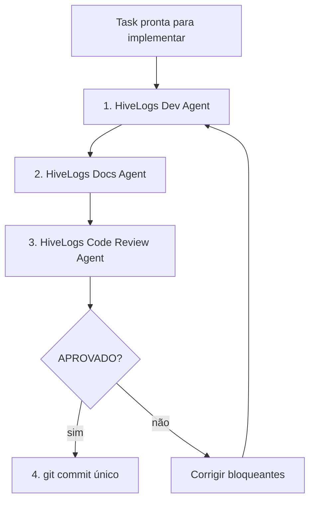

# HiveLogs — Commit Workflow (agentes)

Fluxo obrigatório para concluir uma task com commit seguro.

## Diagrama



## Passos

| # | Agente / skill | Saída esperada |
|---|----------------|----------------|
| 1 | `hivelogs-agent-dev` ou `@HiveLogs Dev` | Código + testes verdes |
| 2 | `hivelogs-agent-docs` ou `@HiveLogs Docs` | shared-memory + task Done |
| 3 | `hivelogs-agent-code-review` ou `@HiveLogs Code Review` | Veredito APROVADO |
| 4 | Commit manual ou pedido explícito do usuário | 1 commit por task |

## Regras

- **Proibido** `git commit` entre passos 1–2 sem passar pelo passo 3
- Review **BLOQUEADO** → voltar ao passo 1 (só itens bloqueantes)
- Mensagem de commit: ver `hivelogs-task-implement`
- Não fazer push em `main` sem PR da techspec

## Prompt sugerido

```
Execute hivelogs-commit-workflow para TASK-NN da TS-NNN:
1. Dev — implementar escopo IN
2. Docs — atualizar shared-memory
3. Code Review — gate antes do commit
4. Commit apenas se APROVADO
```

## Referências

- [docs/agents.md](../../../docs/agents.md)
- [.cursor/agents/README.md](../../agents/README.md)
- [hivelogs-task-implement](../hivelogs-task-implement/SKILL.md)
