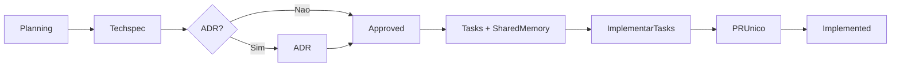

# HiveLogs — Feature Workflow

Fluxo oficial para features no HiveLogs. Detalhes: [docs/techspecs/README.md](../../../docs/techspecs/README.md).

## Visão geral



## Etapas e skills

| # | Etapa | Skill | Gate |
|---|-------|-------|------|
| 1 | Planejamento + dúvidas | `hivelogs-feature-planning` | Perguntas abertas vazias |
| 2 | Techspec por módulo | `hivelogs-techspec` | Status `Approved` |
| 2b | ADR se decisão nova | `hivelogs-adr` | Antes de `Approved` |
| 3 | Tasks + shared-memory | `hivelogs-task-breakdown` | Techspec `Approved` |
| 4 | Branch `feature/TS-NNN-slug` | manual / git | — |
| 5 | Implementar cada task | `hivelogs-commit-workflow` (Dev→Docs→Review→commit) | 1 commit/task |
| 6 | PR único → main | `hivelogs-task-implement` | Todas tasks `Done` |
| 7 | Status `Implemented` | após merge | — |

## Artefatos por techspec

```
docs/techspecs/TS-NNN-slug/
├── planning.md
├── techspec.md
├── shared-memory.md      ← lido antes; atualizado após cada task
└── tasks/TASK-NN-*.md
```

## Regras inegociáveis

- Dúvidas de negócio → perguntar ao usuário (`hivelogs-feature-planning`)
- **1 commit por task**
- **1 PR por techspec** (não por task)
- **Shared-memory** obrigatória entre tasks
- ADR quando decisão arquitetural (não substitui techspec)
- SDKs leves; validação no backend
- Sem push direto em `main`

## Agentes por task

Cada TASK-NN: **Dev → Docs → Code Review → commit** (review é gate). Ver [docs/agents.md](../../../docs/agents.md).

## Skills de apoio (invocar quando aplicável)

| Skill | Quando |
|-------|--------|
| `hivelogs-commit-workflow` | Orquestrar task até commit aprovado |
| `hivelogs-agent-dev` | Só implementação |
| `hivelogs-agent-docs` | Só documentação da task |
| `hivelogs-agent-code-review` | Gate antes do commit |
| `hivelogs-context` | Antes de implementar |
| `hivelogs-mvp-scope` | Classificar feature |
| `hivelogs-security-review` | Auth, chaves, ingestão |
| `hivelogs-adr` | Decisão arquitetural nova |

## Templates

| Fase | Template |
|------|----------|
| Planning | [feature-planning-template.md](../../../docs/templates/feature-planning-template.md) |
| Techspec | [techspec-template.md](../../../docs/templates/techspec-template.md) |
| Task | [task-template.md](../../../docs/templates/task-template.md) |
| Shared memory | [shared-memory-template.md](../../../docs/templates/shared-memory-template.md) |
| PR | [pr-description-template.md](../../../docs/templates/pr-description-template.md) |
