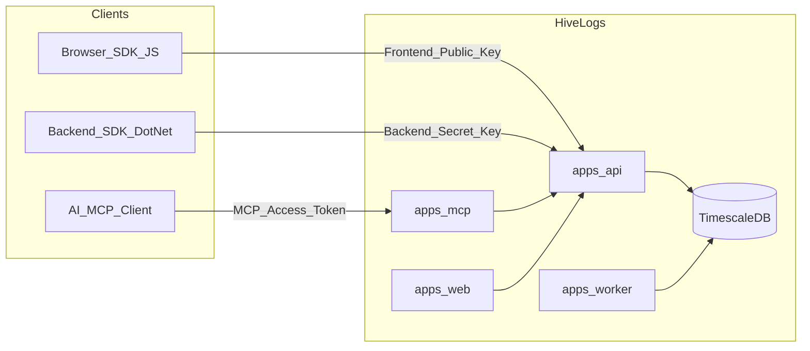

# HiveLogs

Open-source observability and analytics platform for small-to-medium applications and indie projects.

HiveLogs combines concepts from tools like Mixpanel and Grafana with a focus on simplicity, self-hosting, solid architecture, and AI integration via MCP (Model Context Protocol).

## Goals

- **Simple** — Easy to set up and operate without a dedicated ops team.
- **Self-hosted** — Your data stays on your infrastructure.
- **Well-architected** — Clean boundaries between ingestion, processing, visualization, and AI analysis.
- **Lightweight SDKs** — Client libraries capture and send telemetry with minimal overhead; business rules and complex validations run on the backend only.
- **AI-ready** — Query metrics, logs, and errors through MCP-compatible assistants.

## What HiveLogs collects

Connect your front-end and back-end to collect, correlate, and visualize:

- Page views and custom events
- User sessions and online users
- Front-end and back-end errors
- HTTP requests
- Structured backend logs
- Basic metrics
- Data isolated by **organization**, **application**, and **environment**
- Telemetry separation by **`serviceName`** and optional **`moduleName`** metadata

### Telemetry dimensions

HiveLogs separates logs, errors, requests, events, and metrics by technical origin using metadata sent by SDKs or ingestion payloads — not by manually registering services in the dashboard.

| Field | Role |
|-------|------|
| `serviceName` | Main technical origin of the telemetry (defaults to `default` when omitted; stored in lowercase) |
| `moduleName` | Optional subdivision within a service (stored in lowercase when provided) |

Common `serviceName` values include `api`, `web`, `worker`, `notification-service`, and `payment-service`. Modules might be `checkout`, `email-sender`, or `orders`.

**No manual service registration is required in MVP 1.** The same Backend Secret Key can be used by multiple services in the same environment; separation happens through metadata in the payload. SDKs may send `serviceName` and `moduleName` in any casing; **lowercase normalization is mandatory and handled exclusively by the backend** before persistence.

SDKs stay intentionally thin: they capture events and forward payloads without running business rules or heavy validation, so ingestion does not slow down host applications.

```ts
// JS SDK
hivelog.init({
  publicKey: "hvl_pub_prod_xxx",
  endpoint: "https://hivelogs.local",
  serviceName: "web",
  moduleName: "checkout",
});
```

```csharp
// .NET SDK
builder.Services.AddHiveLogs(options =>
{
    options.ApiKey = "hvl_sec_prod_xxx";
    options.Endpoint = "https://hivelogs.local";
    options.ServiceName = "notification-service";
    options.ModuleName = "email-sender";
});
```

See [docs/architecture.md](docs/architecture.md#telemetry-dimensions) and [docs/adr/002-service-and-module-as-telemetry-dimensions.md](docs/adr/002-service-and-module-as-telemetry-dimensions.md).

## Architecture overview



| Component | Role |
|-----------|------|
| `apps/api` | Ingestion API, JWT auth, API key validation |
| `apps/web` | React dashboard |
| `apps/worker` | Aggregations, retention, background jobs |
| `apps/mcp` | MCP server for AI queries and reports |
| `packages/sdk-dotnet` | .NET SDK (`Microsoft.Extensions.Logging`) |
| `packages/sdk-js` | Browser SDK (events, errors, sessions) |
| `packages/shared-contracts` | Shared schemas and types |
| `infra/` | Docker Compose for local development |

See [docs/architecture.md](docs/architecture.md) for detailed module descriptions.

## Monorepo structure

```
hivelogs/
├── apps/
│   ├── api/          # .NET ingestion & management API
│   ├── web/          # React dashboard
│   ├── worker/       # Background processing
│   └── mcp/          # MCP server for AI
├── packages/
│   ├── sdk-dotnet/   # .NET client SDK
│   ├── sdk-js/       # Browser client SDK
│   └── shared-contracts/
├── infra/            # Docker Compose
└── docs/             # Architecture, security, roadmap, ADRs
```

## Initial stack

| Layer | Technology |
|-------|------------|
| Backend | .NET (latest stable), Clean Architecture |
| Database | PostgreSQL + TimescaleDB |
| Auth | JWT (dashboard), API Keys (ingestion) |
| Frontend | React, TypeScript, Vite, shadcn/ui, TanStack Query |
| Local dev | Docker Compose |

## MVP scope (Phase 1)

The first milestone focuses on foundation:

- User authentication (JWT)
- Organizations, applications, environments
- Telemetry dimensions (`serviceName`, optional `moduleName`)
- API key model (three key types)
- Ingestion: frontend events, backend logs, frontend/backend errors, HTTP requests
- Initial dashboard
- Docker Compose + TimescaleDB

Full roadmap: [docs/roadmap.md](docs/roadmap.md)

## Out of MVP scope

Not planned for early releases:

- SDK Node.js
- OpenTelemetry integration
- Distributed tracing
- Custom dashboards and alert rules
- SaaS hosted option
- CI/CD pipelines (setup planned for a later phase)

## Security key model

HiveLogs uses three credential types per environment. See [docs/security-model.md](docs/security-model.md) for the full model.

### Frontend Public Key

- Used by the browser SDK (`packages/sdk-js`)
- **Public by design** — safe to embed in client-side bundles
- Scoped to browser ingestion: events, page views, JS errors, session heartbeat
- May send `serviceName` metadata (typically `web`) and optional `moduleName`
- Restricted by **allowed origins** configured per environment
- Must never have read access or admin permissions

### Backend Secret Key

- Used by the .NET SDK (`packages/sdk-dotnet`) and server-side integrations
- **Secret** — server-side only
- Scoped to backend ingestion: logs, backend errors, HTTP requests, metrics
- Linked to an **Environment**; the same key may be used by multiple services (e.g. `api`, `worker`) — separation is via `serviceName` metadata in the payload
- **Must never** appear in front-end code, `VITE_*` variables, or public repositories

### MCP Access Token

- Used by the MCP server (`apps/mcp`) for AI assistant integrations
- **Secret**, preferably **read-only**
- Scoped to queries: metrics, logs, errors, requests, reports
- Independently revocable without affecting ingestion keys

## Getting started

> Project scaffolding is in place. Application projects will be initialized in upcoming development phases.

**Database only (current):**

```bash
cd infra
cp .env.example .env
docker compose up timescaledb -d
```

Module-specific guides: see README files in each `apps/` and `packages/` directory.

## Documentation

| Document | Description |
|----------|-------------|
| [docs/architecture.md](docs/architecture.md) | System design and domain concepts |
| [docs/security-model.md](docs/security-model.md) | Authentication and API keys |
| [docs/roadmap.md](docs/roadmap.md) | Development phases |
| [docs/adr/001-monorepo-and-stack.md](docs/adr/001-monorepo-and-stack.md) | ADR: monorepo and stack decision |
| [docs/adr/002-service-and-module-as-telemetry-dimensions.md](docs/adr/002-service-and-module-as-telemetry-dimensions.md) | ADR: service and module as telemetry dimensions |

## For contributors / AI agents

- **[AGENTS.md](AGENTS.md)** — monorepo map, conventions, skills, and commands (PT-BR)
- **[docs/templates/](docs/templates/)** — ADR, issue, PR, and module README templates
- **`.cursor/rules/`** and **`.cursor/skills/`** — Cursor rules and project skills (versioned with the repo)

## Contributing

Read [AGENTS.md](AGENTS.md) before making changes. Explore `docs/` and module READMEs for boundaries and responsibilities.

## License

HiveLogs is licensed under the [GNU Affero General Public License v3.0 or later](LICENSE) (AGPL-3.0).

- The project remains **free and open source**.
- You may use, modify, and redistribute it under the same license.
- If you run a **modified version as a network service** (e.g. hosted observability SaaS), you must **make the corresponding source code available** to users.
- You **cannot** take HiveLogs (or a derivative), keep changes closed-source, and sell it as a proprietary paid product without complying with AGPL obligations.

See [LICENSE](LICENSE) for the full text.
