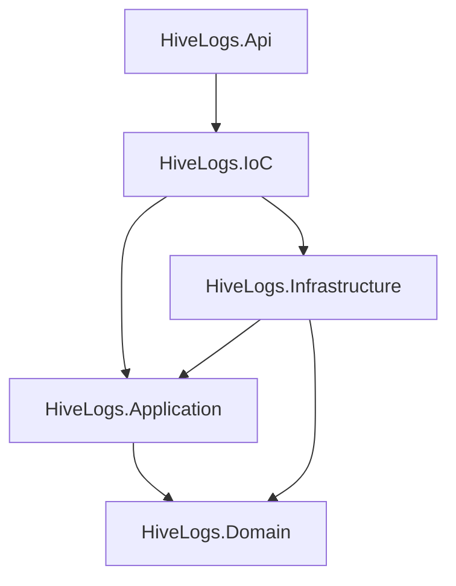

# apps/api

API HTTP principal do HiveLogs — ingestão, autenticação e gestão de recursos.

## Visão geral da arquitetura

O backend segue **DDD pragmático + Clean Architecture + IoC separado**, conforme [ADR 003](../../docs/adr/003-backend-clean-architecture-and-error-model.md).



## Projetos e responsabilidades

| Projeto | Responsabilidade |
|---------|------------------|
| `HiveLogs.Api` | HTTP, controllers, middlewares, ProblemDetails, mapeamento de erros |
| `HiveLogs.IoC` | Composition root — `AddHiveLogsDependencies` |
| `HiveLogs.Application` | Casos de uso, Application Services, requests/responses/validators |
| `HiveLogs.Domain` | Entidades, erros, Result, regras de domínio |
| `HiveLogs.Infrastructure` | EF Core, DbContext, repositórios, integrações |

## Regras de dependência

```
Api → IoC
IoC → Application, Infrastructure
Infrastructure → Application, Domain
Application → Domain
Domain → (nenhuma referência interna)
```

`HiveLogs.Api` referencia **somente** `HiveLogs.IoC`. Não registre EF ou repositórios diretamente na API.

## DDD pragmático

**Usar no domínio:** Entities, Aggregates (quando necessário), Value Objects, Enums, Domain Errors, Domain Exceptions, invariantes.

**Evitar no MVP inicial:** Domain Services prematuros, abstrações sem uso real, Domain Events, CQRS estrito.

## Application Services (sem CQRS estrito)

HiveLogs não adotará CQRS estrito no MVP 1.

A camada Application será organizada por contexto funcional usando Application Services.

O padrão inicial será:

- `I<Context>Service`
- `<Context>Service`
- `Requests/`
- `Responses/`
- `Validators/`

Commands, Queries e Handlers poderão ser introduzidos futuramente apenas quando reduzirem complexidade em vez de adicionar cerimônia.

## Camada IoC

`Program.cs` delega o registro de dependências:

```csharp
builder.Services.AddHiveLogsDependencies(builder.Configuration);
```

Implementação em `HiveLogs.IoC/DependencyInjection.cs`.

## Padrão de erros

| Situação | Mecanismo |
|----------|-----------|
| Erro esperado (not found, conflito, validação) | `Result` / `Result<T>` + `Error` |
| Falha inesperada ou invariante crítica | Exception → `GlobalExceptionHandler` |
| Contrato HTTP | `ProblemDetails` com `code` e `traceId` (`Content-Type: application/problem+json`) |

> Future improvement: `DomainException` may evolve to carry an `Error` or `ErrorType`, allowing domain exceptions to map to more specific HTTP statuses and error codes instead of always returning `general.validation`.

### Mapeamento HTTP

| ErrorType | Status |
|-----------|--------|
| Validation | 400 |
| NotFound | 404 |
| Conflict | 409 |
| Unauthorized | 401 |
| Forbidden | 403 |
| Failure | 500 |

### Convenção de códigos

`<context>.<reason>` — exemplos: `organizations.not_found`, `general.unexpected`.

Erros genéricos em `GeneralErrors` (`HiveLogs.Domain/Common/Errors/GeneralErrors.cs`).

Controllers podem usar `result.ToActionResult(HttpContext)` de `Infrastructure/ResultMapping/`.

## Estrutura

```
apps/api/
├── HiveLogs.Api.sln
├── Directory.Build.props
├── src/
│   ├── HiveLogs.Api/
│   ├── HiveLogs.IoC/
│   ├── HiveLogs.Application/
│   ├── HiveLogs.Domain/
│   └── HiveLogs.Infrastructure/
└── tests/
    ├── HiveLogs.Api.Tests/
    ├── HiveLogs.Application.Tests/
    ├── HiveLogs.Domain.Tests/
    └── HiveLogs.Infrastructure.Tests/
```

## Como rodar a API

Pré-requisito: .NET 10 SDK (ou versão definida em `Directory.Build.props`).

```bash
cd apps/api
dotnet restore
dotnet build
dotnet run --project src/HiveLogs.Api
```

Health check (não depende do banco):

```http
GET /health
```

```json
{
  "status": "healthy",
  "service": "hivelogs-api"
}
```

## Como rodar testes

```bash
cd apps/api
dotnet test
```

## Connection string

Chave: **`Default`** (alinhada a `infra/.env.example` e Docker Compose).

`appsettings.Development.json`:

```json
"ConnectionStrings": {
  "Default": "Host=localhost;Port=5432;Database=hivelogs;Username=hivelogs;Password=change-me"
}
```

Para desenvolvimento local com TimescaleDB:

```bash
cd infra
cp .env.example .env
docker compose up timescaledb -d
```

Ajuste a senha em `appsettings.Development.json` para coincidir com `TIMESCALEDB_PASSWORD` no seu `.env`.

Não versione secrets reais.

## Referências

- [docs/architecture.md](../../docs/architecture.md)
- [docs/security-model.md](../../docs/security-model.md)
- [docs/techspecs/TS-001-backend-architecture-foundation/](../../docs/techspecs/TS-001-backend-architecture-foundation/)
- [ADR 003](../../docs/adr/003-backend-clean-architecture-and-error-model.md)
