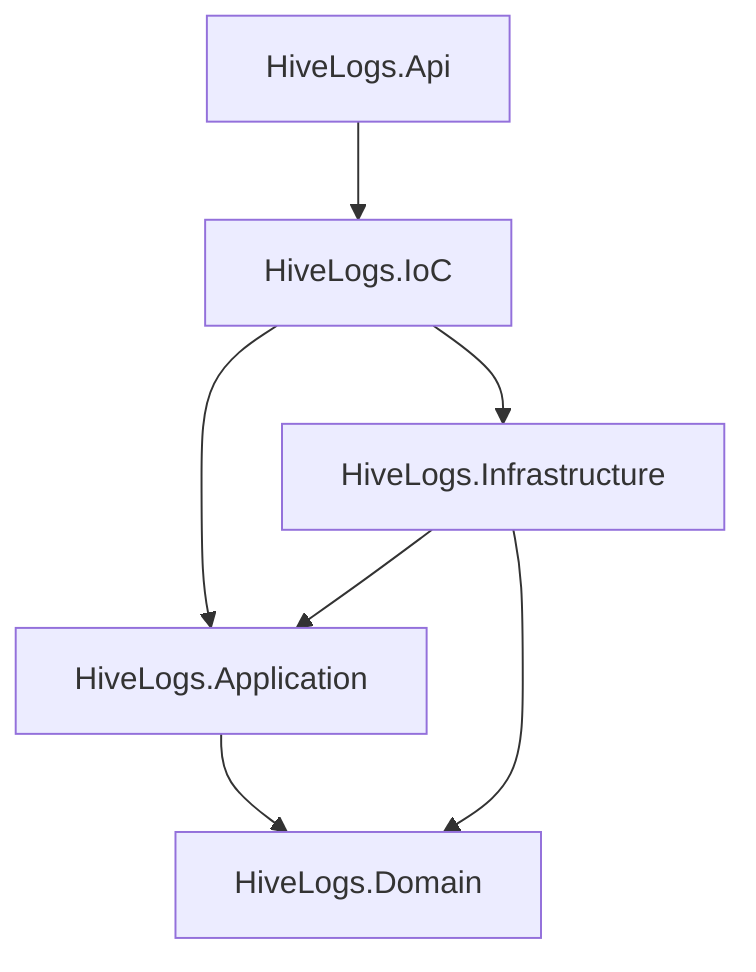

# apps/api

API HTTP principal do HiveLogs — ingestão, autenticação e gestão de recursos.

## Visão geral da arquitetura

O backend segue **DDD pragmático + Clean Architecture + IoC separado**, conforme [ADR 003](../../docs/adr/003-backend-clean-architecture-and-error-model.md).



## Projetos e responsabilidades

| Projeto | Responsabilidade |
|---------|------------------|
| `HiveLogs.Api` | HTTP, controllers, middlewares, ProblemDetails, mapeamento de erros |
| `HiveLogs.IoC` | Composition root — `AddHiveLogsDependencies` |
| `HiveLogs.Application` | Casos de uso, Application Services, requests/responses/validators |
| `HiveLogs.Domain` | Entidades, erros, Result, regras de domínio |
| `HiveLogs.Infrastructure` | EF Core, DbContext, repositórios, integrações |

## Regras de dependência

```
Api → IoC
IoC → Application, Infrastructure
Infrastructure → Application, Domain
Application → Domain
Domain → (nenhuma referência interna)
```

`HiveLogs.Api` referencia **somente** `HiveLogs.IoC`. Não registre EF ou repositórios diretamente na API.

## DDD pragmático

**Usar no domínio:** Entities, Aggregates (quando necessário), Value Objects, Enums, Domain Errors, Domain Exceptions, invariantes.

**Evitar no MVP inicial:** Domain Services prematuros, abstrações sem uso real, Domain Events, CQRS estrito.

## Application Services (sem CQRS estrito)

HiveLogs não adotará CQRS estrito no MVP 1.

A camada Application será organizada por contexto funcional usando Application Services.

O padrão inicial será:

- `I<Context>Service`
- `<Context>Service`
- `Requests/`
- `Responses/`
- `Validators/`

Commands, Queries e Handlers poderão ser introduzidos futuramente apenas quando reduzirem complexidade em vez de adicionar cerimônia.

## Camada IoC

`Program.cs` delega o registro de dependências:

```csharp
builder.Services.AddHiveLogsDependencies(builder.Configuration);
```

Implementação em `HiveLogs.IoC/DependencyInjection.cs`.

## Padrão de erros

| Situação | Mecanismo |
|----------|-----------|
| Erro esperado (not found, conflito, validação) | `Result` / `Result<T>` + `Error` |
| Falha inesperada ou invariante crítica | Exception → `GlobalExceptionHandler` |
| Contrato HTTP | `ProblemDetails` com `code` e `traceId` (`Content-Type: application/problem+json`) |

> Future improvement: `DomainException` may evolve to carry an `Error` or `ErrorType`, allowing domain exceptions to map to more specific HTTP statuses and error codes instead of always returning `general.validation`.

### Mapeamento HTTP

| ErrorType | Status |
|-----------|--------|
| Validation | 400 |
| NotFound | 404 |
| Conflict | 409 |
| Unauthorized | 401 |
| Forbidden | 403 |
| Failure | 500 |

### Convenção de códigos

`<context>.<reason>` — exemplos: `organizations.not_found`, `general.unexpected`.

Erros genéricos em `GeneralErrors` (`HiveLogs.Domain/Common/Errors/GeneralErrors.cs`).

Controllers podem usar `result.ToActionResult(HttpContext)` de `Infrastructure/ResultMapping/`.

## Estrutura

```
apps/api/
├── HiveLogs.Api.sln
├── Directory.Build.props
├── src/
│   ├── HiveLogs.Api/
│   ├── HiveLogs.IoC/
│   ├── HiveLogs.Application/
│   ├── HiveLogs.Domain/
│   └── HiveLogs.Infrastructure/
└── tests/
    ├── HiveLogs.Api.Tests/
    ├── HiveLogs.Application.Tests/
    ├── HiveLogs.Domain.Tests/
    └── HiveLogs.Infrastructure.Tests/
```

## Como rodar a API

Pré-requisito: .NET 10 SDK (ou versão definida em `Directory.Build.props`).

```bash
cd apps/api
dotnet restore
dotnet build
dotnet run --project src/HiveLogs.Api
```

Health check (não depende do banco):

```http
GET /health
```

```json
{
  "status": "healthy",
  "service": "hivelogs-api"
}
```

## Como rodar testes

O comando padrão **não exige** PostgreSQL local:

```bash
cd apps/api
dotnet test
```

Os testes de API usam EF InMemory (`Testing:UseInMemoryDatabase`) para manter o ciclo de desenvolvimento rápido. Testes de integração com PostgreSQL real são **opt-in** e excluídos do run padrão via `test.runsettings`.

Testes de persistência relacional real (queries EF contra PostgreSQL):

```bash
cd apps/api
dotnet test --settings test.integration.runsettings --filter "Category=Integration"
```

Pré-requisitos para integração: TimescaleDB/Postgres em execução (`cd infra && docker compose up timescaledb -d`), credenciais padrão do compose (`hivelogs`/`hivelogs`).

Testcontainers pode ser avaliado futuramente para automatizar o setup de integração, mas **não é obrigatório** no CI padrão.

## Core domain (TS-002)

Hierarquia de isolamento:

```
Organization
  └── Application
        └── Environment
```

Rotas HTTP usam **Application**; no código de domínio a entidade é **`MonitoredApplication`** (evita colisão com `HiveLogs.Application`). Ver [ADR 004](../../docs/adr/004-core-domain-monitored-application.md).

> **Autenticação:** os endpoints abaixo estão **sem auth** (MVP 1 — gestão aberta até JWT/API keys em techspecs futuras).

### Migrations (`InitialCoreDomain`)

Pré-requisitos: TimescaleDB/Postgres em execução (`infra/docker compose up timescaledb -d`), connection string `Default` configurada, ferramenta EF instalada (`dotnet tool install -g dotnet-ef`).

```bash
cd apps/api
dotnet ef database update \
  --project src/HiveLogs.Infrastructure \
  --startup-project src/HiveLogs.Api
```

Migration: `20260602214111_InitialCoreDomain` — tabelas `organizations`, `applications`, `environments`.

Migration: `20260604120000_AddSelfHostedAccessModel` — tabelas `users`, `organization_members`, `setup_state`.

## Self-hosted setup (TS-003)

Instalação nova começa em `SetupRequired`. O operador configura a senha de setup no ambiente e executa o setup uma única vez.

| Variável / config | Uso |
|-------------------|-----|
| `HIVELOGS_SETUP_PASSWORD` | Senha que autoriza `POST /setup/initialize` |
| `Setup:Password` | Equivalente em `appsettings` |

> Após setup concluído, alterar a senha de setup **não** altera usuários nem organização no banco.

O backend **não gera** senha temporária. O admin define `adminPassword` no body do setup; apenas o hash é persistido. Ver [ADR 005](../../docs/adr/005-self-hosted-setup-and-access-model.md).

### Endpoints de setup

| Método | Rota |
|--------|------|
| GET | `/setup/status` |
| POST | `/setup/initialize` |

**GET** `/setup/status` (público):

```json
{ "status": "SetupRequired", "setupRequired": true }
```

**POST** `/setup/initialize` — request:

```json
{
  "setupPassword": "change-me",
  "organizationName": "Acme Corp",
  "adminName": "Admin",
  "adminEmail": "admin@acme.com",
  "adminPassword": "StrongPass123"
}
```

Response `201 Created` (sem senhas nem hash):

```json
{
  "setupCompleted": true,
  "organization": { "id": "...", "name": "Acme Corp" },
  "adminUser": {
    "id": "...",
    "name": "Admin",
    "email": "admin@acme.com",
    "role": "Admin",
    "mustChangePassword": false
  }
}
```

Códigos de erro: `setup.already_completed` (409), `setup.invalid_setup_password` (401), `setup.password_not_configured` (500), `users.*` (validação/conflito).

> **Autenticação JWT:** ainda não implementada. Endpoints de org/app/env e setup permanecem sem middleware de auth até a feature 004.

### Endpoints REST

| Método | Rota |
|--------|------|
| POST | `/organizations` |
| GET | `/organizations` |
| GET | `/organizations/{organizationId}` |
| POST | `/organizations/{organizationId}/applications` |
| GET | `/organizations/{organizationId}/applications` |
| GET | `/organizations/{organizationId}/applications/{applicationId}` |
| POST | `/organizations/{organizationId}/applications/{applicationId}/environments` |
| GET | `/organizations/{organizationId}/applications/{applicationId}/environments` |
| GET | `/organizations/{organizationId}/applications/{applicationId}/environments/{environmentId}` |

Erros esperados retornam `application/problem+json` com `code` e `traceId` (ex.: `organizations.not_found`, `applications.name_already_exists`).

#### Organizations

**POST** `/organizations`

Request:

```json
{ "name": "Acme Corp" }
```

Response `201 Created`:

```json
{
  "id": "3fa85f64-5717-4562-b3fc-2c963f66afa6",
  "name": "Acme Corp",
  "createdAt": "2026-06-02T12:00:00+00:00",
  "updatedAt": "2026-06-02T12:00:00+00:00"
}
```

**GET** `/organizations`

Response `200 OK`:

```json
[
  {
    "id": "3fa85f64-5717-4562-b3fc-2c963f66afa6",
    "name": "Acme Corp",
    "createdAt": "2026-06-02T12:00:00+00:00",
    "updatedAt": "2026-06-02T12:00:00+00:00"
  }
]
```

**GET** `/organizations/{organizationId}`

Response `200 OK`: mesmo shape do item acima.

#### Applications

**POST** `/organizations/{organizationId}/applications`

Request:

```json
{ "name": "Loja Web" }
```

Response `201 Created`:

```json
{
  "id": "7c9e6679-7425-40de-944b-e07fc1f90ae7",
  "organizationId": "3fa85f64-5717-4562-b3fc-2c963f66afa6",
  "name": "Loja Web",
  "createdAt": "2026-06-02T12:00:00+00:00",
  "updatedAt": "2026-06-02T12:00:00+00:00"
}
```

**GET** `/organizations/{organizationId}/applications`

Response `200 OK`:

```json
[
  {
    "id": "7c9e6679-7425-40de-944b-e07fc1f90ae7",
    "organizationId": "3fa85f64-5717-4562-b3fc-2c963f66afa6",
    "name": "Loja Web",
    "createdAt": "2026-06-02T12:00:00+00:00",
    "updatedAt": "2026-06-02T12:00:00+00:00"
  }
]
```

**GET** `/organizations/{organizationId}/applications/{applicationId}`

Response `200 OK`: mesmo shape do item acima.

#### Environments

**POST** `/organizations/{organizationId}/applications/{applicationId}/environments`

Request:

```json
{ "name": "production" }
```

Response `201 Created`:

```json
{
  "id": "a1b2c3d4-e5f6-7890-abcd-ef1234567890",
  "applicationId": "7c9e6679-7425-40de-944b-e07fc1f90ae7",
  "name": "production",
  "createdAt": "2026-06-02T12:00:00+00:00",
  "updatedAt": "2026-06-02T12:00:00+00:00"
}
```

**GET** `/organizations/{organizationId}/applications/{applicationId}/environments`

Response `200 OK`:

```json
[
  {
    "id": "a1b2c3d4-e5f6-7890-abcd-ef1234567890",
    "applicationId": "7c9e6679-7425-40de-944b-e07fc1f90ae7",
    "name": "production",
    "createdAt": "2026-06-02T12:00:00+00:00",
    "updatedAt": "2026-06-02T12:00:00+00:00"
  }
]
```

**GET** `/organizations/{organizationId}/applications/{applicationId}/environments/{environmentId}`

Response `200 OK`: mesmo shape do item acima.

## Connection string

Chave: **`Default`** (alinhada a `infra/.env.example` e Docker Compose).

`appsettings.Development.json`:

```json
"ConnectionStrings": {
  "Default": "Host=localhost;Port=5432;Database=hivelogs;Username=hivelogs;Password=change-me"
}
```

Para desenvolvimento local com TimescaleDB:

```bash
cd infra
cp .env.example .env
docker compose up timescaledb -d
```

Ajuste a senha em `appsettings.Development.json` para coincidir com `TIMESCALEDB_PASSWORD` no seu `.env`.

Não versione secrets reais.

## Referências

- [docs/architecture.md](../../docs/architecture.md)
- [docs/security-model.md](../../docs/security-model.md)
- [docs/techspecs/TS-001-backend-architecture-foundation/](../../docs/techspecs/TS-001-backend-architecture-foundation/)
- [docs/techspecs/TS-002-core-domain/](../../docs/techspecs/TS-002-core-domain/)
- [ADR 003](../../docs/adr/003-backend-clean-architecture-and-error-model.md)
- [ADR 004](../../docs/adr/004-core-domain-monitored-application.md)
