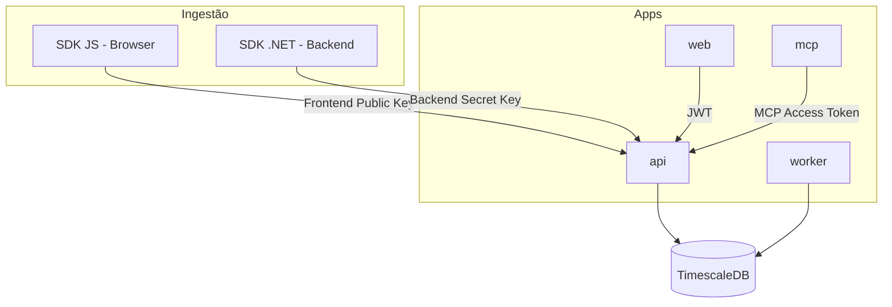

# Arquitetura do HiveLogs

## Visão geral

O HiveLogs é uma plataforma de observabilidade e analytics self-hosted, projetada para aplicações pequenas, médias e projetos indie. O sistema coleta, correlaciona e visualiza dados de front-end e back-end, com suporte futuro a análises por IA via MCP.

A arquitetura segue um modelo de **monorepo multi-serviço**: cada app tem responsabilidade clara, comunica-se via API e banco de dados compartilhado, e evolui de forma independente.



## Módulos principais

### apps/api

**Responsabilidade:** API HTTP principal do sistema.

- Ingestão de eventos, logs, erros e requests HTTP.
- Autenticação de usuários (JWT) para o dashboard.
- Validação e roteamento de API Keys por ambiente.
- **Regras de negócio e validações de ingestão** (schema, metadados, normalização, limites).
- Gestão REST de organizações, aplicações e ambientes ([TS-002](./techspecs/TS-002-core-domain/)).
- Setup inicial self-hosted: organização + admin + membership ([TS-003](./techspecs/TS-003-self-hosted-setup-access-model/); sem JWT/login ainda).

**Entradas:** SDKs (ingestão), dashboard web (gestão e consulta), MCP (consultas read-only).

**Saídas:** Persistência em TimescaleDB, mensagens/filas para o worker (futuro).

**Não deve conter:** UI, lógica de agregação pesada, implementação de tools MCP, código dos SDKs.

---

### apps/web

**Responsabilidade:** Dashboard e interface de usuário.

**Estado atual (TS-004 + TS-005):** Vite + React, TanStack Query, React Router, `httpClient` (ky), `ProblemDetails`/`ApiError`, tema dark-first (shadcn/ui). Tela funcional de setup inicial (`GET/POST /setup/*`, gates de rota). Login real: TS-006.

**Guias operacionais:** [docs/guides/web-dashboard-development.md](guides/web-dashboard-development.md), [docs/guides/design-handoff-pencil.md](guides/design-handoff-pencil.md).

- Visualização de métricas, sessões, eventos, logs, erros e requests (fases futuras).
- Gestão de organizações, aplicações, ambientes e chaves (fases futuras).
- Autenticação via JWT emitido pela API (fase futura).

**Entradas:** API REST (`VITE_API_BASE_URL`).

**Saídas:** Interface para o usuário final.

**Não deve conter:** Lógica de ingestão, secrets de backend, processamento assíncrono, regras de retenção de dados.

---

### apps/worker

**Responsabilidade:** Processamento assíncrono e background jobs.

- Agregações temporais (contagens, percentis, rollups).
- Políticas de retenção e limpeza de dados antigos.
- Processamento de filas pós-ingestão.

**Entradas:** Banco de dados, filas/eventos (a definir).

**Saídas:** Tabelas agregadas, métricas pré-calculadas.

**Não deve conter:** Endpoints HTTP públicos de ingestão, UI, autenticação de usuário final.

---

### apps/mcp

**Responsabilidade:** Servidor MCP para integração com assistentes de IA.

- Tools de leitura: métricas, logs, erros, requests.
- Geração de relatórios e análises (fases futuras).
- Autenticação via MCP Access Token (escopo read-only preferencial).

**Entradas:** MCP Access Token, API interna ou banco (a definir).

**Saídas:** Respostas estruturadas para clientes MCP (Cursor, Claude Desktop, etc.).

**Não deve conter:** Ingestão de dados, UI, lógica de agregação pesada (delegar ao worker).

---

### packages/sdk-dotnet

**Responsabilidade:** SDK para integração em aplicações .NET.

- Provider para `Microsoft.Extensions.Logging`.
- Envio de logs, erros e requests HTTP do backend.
- Configuração via Backend Secret Key.
- Captura e envio assíncrono de payloads — **sem regras de negócio nem validações complexas no cliente**.

**Não deve conter:** Lógica de dashboard, autenticação de usuário, regras de retenção, normalização de metadados, validação de schema além do mínimo para serialização.

---

### packages/sdk-js

**Responsabilidade:** SDK para integração em aplicações browser.

- Captura de eventos customizados, page views, erros JavaScript.
- Heartbeat de sessão e usuários online (fases futuras).
- Configuração via Frontend Public Key.
- Captura e envio com impacto mínimo no runtime — **sem regras de negócio nem validações complexas no cliente**.

**Não deve conter:** Backend Secret Key, lógica server-side, componentes de UI do dashboard, normalização de metadados, validação pesada de payload.

---

### packages/shared-contracts

**Responsabilidade:** Contratos e tipos compartilhados entre API, frontend e SDKs.

- Schemas de eventos e payloads de ingestão.
- Enums compartilhados (tipos de evento, severidade, etc.).
- Tipos gerados a partir de OpenAPI (futuro).
- Documentação dos payloads.

**Não deve conter:** Regras de negócio, lógica de validação server-side, código de infraestrutura.

---

### infra

**Responsabilidade:** Ambiente de desenvolvimento e deploy local.

- Docker Compose com TimescaleDB e placeholders para apps.
- Variáveis de ambiente por serviço (`.env.example`).
- Documentação de como subir o ambiente local.

**Não deve conter:** Código de aplicação, migrations, secrets reais.

---

## Hierarquia de dados

Os dados são organizados em três níveis:

```
Organization
  └── Application
        └── Environment (ex: production, staging, development)
```

Cada **Environment** possui seu próprio conjunto de chaves e dados isolados. Ingestão, consultas e relatórios sempre respeitam esse isolamento.

## Princípios de design dos SDKs

Os SDKs (`packages/sdk-dotnet`, `packages/sdk-js`) devem ser **o mais leves possível** para não impactar o desempenho das aplicações que os utilizam.

| Camada | Responsabilidade |
|--------|------------------|
| **SDK** | Capturar telemetria, montar payload, enviar de forma assíncrona/não bloqueante |
| **Backend (`apps/api`)** | Validar, normalizar, enriquecer, aplicar regras de negócio e persistir |

Regras gerais:

- **Regras de negócio e validações complexas ficam no backend.** Exemplos: normalização de `serviceName`/`moduleName`, validação de tamanho e caracteres, fallback `default`, validação de API Key e tipo de ingestão.
- **SDKs não devem replicar essa lógica.** Duplicar validações no cliente aumenta latência no envio, consumo de CPU/memória e risco de divergência entre versões do SDK e do servidor.
- **SDKs podem aplicar apenas o mínimo necessário** para serialização segura e envio (ex.: truncar campos obviamente inválidos só se isso for trivial e sem custo perceptível — preferência sempre por delegar ao backend).
- **Objetivo:** integração observável com overhead mínimo no app host, especialmente no browser.

## Telemetry Dimensions

`Organization`, `Application` e `Environment` são recursos configurados no HiveLogs. Já `serviceName` e `moduleName` são **dimensões de telemetria** — metadados enviados pela configuração do SDK ou diretamente no payload de ingestão.

| Dimensão | Obrigatório | Descrição |
|----------|-------------|-----------|
| `serviceName` | Sim (com fallback) | Origem técnica principal da telemetria |
| `moduleName` | Não | Subdivisão opcional dentro do `serviceName` |

- **`serviceName`** separa a origem técnica dos dados (ex.: `api`, `web`, `worker`, `notification-service`).
- **`moduleName`** adiciona granularidade opcional (ex.: `auth`, `checkout`, `email-sender`).
- Se `serviceName` não for informado, o backend deve usar o valor padrão **`default`**.
- O backend deve **normalizar `serviceName` e `moduleName` para lowercase** antes de persistir, filtrar, agrupar e exibir — essa normalização é **obrigatória** e **exclusiva do backend**; os SDKs não precisam (e não devem ser obrigados a) aplicar essa transformação.
- Esses campos devem estar disponíveis para **logs**, **events**, **metrics**, **sessions**, **requests** e **errors**, quando aplicável.
- O backend deve armazenar, filtrar, agrupar e exibir dados usando `serviceName` e `moduleName` quando fornecidos.

Exemplos:

| `serviceName` | `moduleName` |
|---------------|--------------|
| `api` | `auth` |
| `notification-service` | `email-sender` |
| `worker` | `retention` |
| `web` | `checkout` |

> Service and Module are not domain entities in MVP 1. They are telemetry dimensions.

Não é necessário registrar serviços manualmente no dashboard. A mesma Backend Secret Key pode ser usada por múltiplos serviços no mesmo ambiente; a separação ocorre via metadados no payload.

## Conceitos de domínio

**Organization**, **Application** e **Environment** estão implementados no backend (`apps/api`, [TS-002](./techspecs/TS-002-core-domain/)): entidades, repositórios, Application Services e 9 endpoints REST. A entidade C# de Application é `MonitoredApplication` ([ADR 004](./adr/004-core-domain-monitored-application.md)); rotas e JSON da API usam `application` / `applicationId`. API keys e auth por ambiente vêm em techspecs posteriores.

### Organization

Tenant principal do sistema. Agrupa aplicações e usuários. Exemplo: uma empresa ou um desenvolvedor indie.

### Application

Uma aplicação monitorada dentro de uma organização. Exemplo: "Loja Web", "API de Pagamentos".

### Environment

Instância de deploy de uma aplicação. Exemplo: `production`, `staging`, `development`. Cada ambiente terá chaves e dados separados quando o modelo de API Keys for implementado.

### API Keys

Credenciais de ingestão e integração associadas a um Environment. Três tipos:

| Tipo | Uso | Exposição |
|------|-----|-----------|
| Frontend Public Key | SDK JS, eventos browser | Pública (pode ir no bundle) |
| Backend Secret Key | SDK .NET, logs/erros server | Secreta (apenas servidor) |
| MCP Access Token | Servidor MCP, consultas IA | Secreta, escopo read-only |

### Logs

Registros estruturados ou semi-estruturados emitidos pelo backend. Integração via SDK .NET e `Microsoft.Extensions.Logging`.

### Events

Eventos customizados de produto/analytics (ex: "checkout_completed", "button_clicked"). Originados principalmente do SDK JS.

### Metrics

Medições numéricas agregáveis ao longo do tempo (contagens, latências, gauges). Derivadas de eventos, requests ou agregações do worker.

### Sessions

Agrupamento temporal de atividade de um visitante/usuário no front-end. Mantidas via heartbeat do SDK JS.

### Requests

Registros de chamadas HTTP (método, path, status, duração). Originados do backend (SDK .NET) e, futuramente, do front-end.

### Errors

Exceções e erros capturados no front-end (JS) ou back-end (.NET), com stack trace e contexto.

### Reports

Relatórios e análises gerados por IA via MCP. Exemplos: resumo diário, detecção de anomalias, comparação entre ambientes.

## Fluxo de dados

1. **Ingestão:** SDKs enviam dados para `apps/api` usando API Keys.
2. **Persistência:** API valida, enriquece e grava em TimescaleDB.
3. **Processamento:** `apps/worker` agrega, aplica retenção e pré-calcula métricas.
4. **Visualização:** `apps/web` consulta API e exibe dashboards.
5. **Análise IA:** `apps/mcp` expõe tools de leitura para assistentes de IA.

## Padronização para agentes

O repositório inclui configuração versionada para agentes de código:

- [docs/agents.md](./agents.md) — **três agentes** (Dev, Docs, Code Review) e fluxo pré-commit
- [AGENTS.md](../AGENTS.md) — índice mestre, mapa do monorepo e skills
- [.cursor/agents/](../.cursor/agents/) — definições `@HiveLogs Dev`, `@HiveLogs Docs`, `@HiveLogs Code Review`
- [.cursor/rules/](../.cursor/rules/) — regras automáticas por contexto
- [.cursor/skills/](../.cursor/skills/) — workflows (commit, ADR, segurança, escopo MVP)
- [docs/templates/](./templates/) — templates de ADR, issue, PR e README de módulo

**Gate de commit:** nenhum commit de task sem Code Review **APROVADO** (`hivelogs-commit-workflow`).

## Próximos passos

Consulte [roadmap.md](./roadmap.md) para o plano de implementação por fase, [security-model.md](./security-model.md) para o modelo de chaves e autenticação, e [adr/002-service-and-module-as-telemetry-dimensions.md](./adr/002-service-and-module-as-telemetry-dimensions.md) para a decisão sobre dimensões de telemetria.
